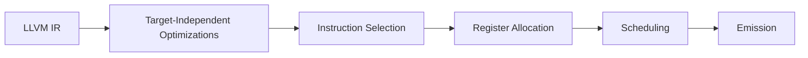

Фаза **lowering IR** в LLVM — это процесс преобразования высокоуровневого промежуточного представления (IR) в низкоуровневое, максимально приближенное к машинному коду. Это критически важный этап перед непосредственной кодогенерацией. Рассмотрим его детально:

### Суть процесса
1. **Цель**:  
   Приведение абстрактного LLVM-IR к форме, отражающей особенности целевой архитектуры (регистры, инструкции, ABI).

2. **Что меняется**:
   - Вызовы функций → машинные инструкции `call`
   - Векторные операции → конкретные SIMD-инструкции (SSE/AVX/NEON)
   - Виртуальные регистры → физические регистры или стековые слоты
   - Абстрактные типы данных → машинные типы (например, `i64` на 32-битной платформе может стать парой `i32`)

### Ключевые этапы lowering-а


### Конкретные преобразования
1. **Instruction Selection** (SelectionDAG):
   ```cpp
   // До
   %sum = add i32 %a, %b
   
   // После (для x86)
   MOV eax, [%a]
   ADD eax, [%b]
   ```

2. **ABI Lowering**:
   - Преобразование соглашений о вызовах
   - Распределение параметров по регистрам/стекам
   - Обработка возвращаемых значений

3. **Legalization**:
   - Замена неподдерживаемых операций (например, деление → вызов runtime-функции)
   - Разбиение 64-битных операций на 32-битные для ARMv6

### Где это реализовано в LLVM
1. **Таблицы описания** (TableGen):
   ```tablegen
   def ADD32rr : Instruction<0x01, (outs GR32:$dst), (ins GR32:$src1, GR32:$src2),
                   "add {$dst, $src1, $src2|$dst, $src1, $src2}",
                   [(set GR32:$dst, (add GR32:$src1, GR32:$src2))>;
   ```

2. **Проходы**:
   - `llvm::TargetPassConfig::addIRPasses()`
   - `llvm::TargetLoweringBase::LowerOperation()`

### Пример: Lowering для условного перехода
**До**:
```llvm
br i1 %cond, label %true, label %false
```

**После** (ARM):
```asm
    cmp r0, #0
    beq Lfalse
Ltrue:
    ...
```

### Проблемы, решаемые lowering-ом
1. **Платформенные ограничения**:
   - Отсутствие аппаратного деления → вызов функции `__udivsi3` (Но в других компиляторах может происходить и ранее)
   - Неподдерживаемые типы (например, `i128` на x86-64) (Но в других компиляторах может происходить и ранее)

2. **ABI-требования** (call convention, etc):
   - Размещение первых 3 параметров в RDI, RSI, RDX (Sys-V AMD64)
   - Выравнивание стека

3. **Оптимизации**:
   - Замена `switch` на таблицу переходов
   - Векторизация под конкретный набор инструкций (SSE vs AVX512) (Но в других компиляторах может происходить и ранее)

### Инструменты для анализа
1. **Просмотр IR между стадиями**:
   ```bash
   llc -print-after-all file.ll
   ```

2. **Генерация диаграмм**:
   ```bash
   llc -view-dag-combine1-dags file.ll
   ```

Эта фаза является мостом между платформенно-независимыми оптимизациями и собственно кодогенерацией, обеспечивая адаптацию к конкретному железу.
