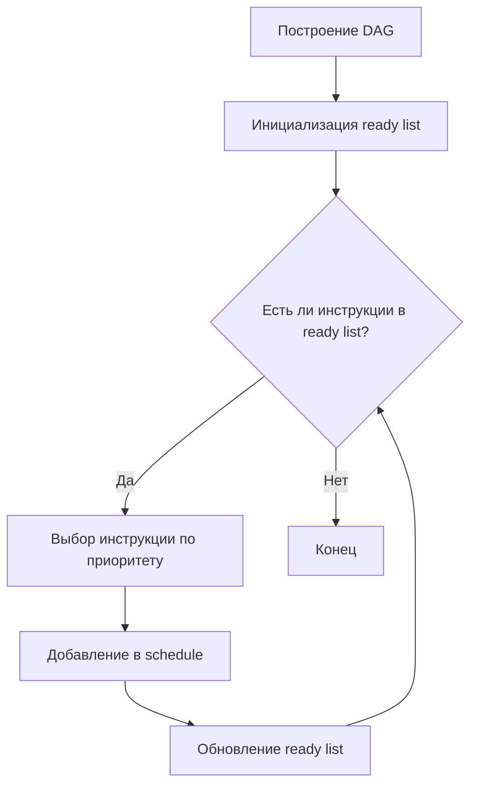

В LLVM используются различные алгоритмы планирования инструкций для оптимизации выполнения кода. Рассмотрим три упомянутых алгоритма:

### 1. List Scheduling (Списочное планирование)
**Принцип работы:**
- Работает на базе Directed Acyclic Graph (DAG) зависимостей между инструкциями
- Поддерживает два списка: готовые к выполнению инструкции и уже запланированные
- На каждом шаге выбирает инструкцию с наивысшим приоритетом из готовых

**Ключевые особенности:**


**Где используется в LLVM:**
- Реализован в `GreedyScheduler` (lib/CodeGen/MachineScheduler.cpp)
- Приоритеты определяются через `SchedulingPriorityQueue`
- Учитывает:
  - Критические пути
  - Задержки инструкций
  - Ресурсные конфликты

### 2. Post-order Scheduling (Планирование в обратном порядке)
**Особенности реализации:**
```cpp
// Примерный алгоритм в псевдокоде
void schedulePostOrder(BasicBlock *BB) {
    ReversePostOrderTraversal RPOT(BB);
    for (auto &Inst : RPOT) {
        if (canSchedule(Inst)) {
            addToSchedule(Inst);
        }
    }
}
```

**Преимущества:**
- Минимизирует регистровое давление
- Эффективен для VLIW-архитектур
- Используется в:
  - `PostRAMachineScheduler` (для архитектур с ограниченными ресурсами)
  - `PostRASchedulerList` (после регистровой аллокации)

### 3. Clustered Scheduling (Кластерное планирование)
**Типичная реализация:**
```python
def cluster_schedule(instructions):
    clusters = []
    current_cluster = []
    
    for inst in instructions:
        if conflicts_with(current_cluster, inst):
            clusters.append(current_cluster)
            current_cluster = []
        current_cluster.append(inst)
    
    if current_cluster:
        clusters.append(current_cluster)
    
    return clusters
```

**Где применяется в LLVM:**
1. Для архитектур с кластерными регистрами (например, Hexagon)
2. В `ConvergingVLIWScheduler`
3. При работе с:
   - Кластерами функциональных устройств
   - Распределенными регистровыми файлами
   - NUMA-подобными архитектурами

### Сравнение алгоритмов
| Алгоритм             | Сложность | Регистровое давление | Поддержка VLIW | Пример цели |
|----------------------|-----------|-----------------------|----------------|-------------|
| List Scheduling      | O(n log n)| Среднее               | Нет            | x86         |
| Post-order           | O(n)      | Низкое                | Да             | DSP         |
| Clustered            | O(n²)     | Контролируемое        | Да             | Hexagon     |

### Практическое применение в LLVM
1. **Выбор алгоритма** определяется через `TargetSchedule.td` (TableGen)
2. **Настройки** указываются в:
   ```tablegen
   def MyModel : SchedMachineModel {
     let MicroOpBufferSize = 32;
     let LoadLatency = 3;
     let ListReduce = true;  // Использовать list scheduling
   }
   ```
3. **Алгоритмы комбинируются** - например:
   - Фаза до RA: Post-order
   - Фаза после RA: Clustered

Эти алгоритмы составляют основу подсистемы MachineScheduler в LLVM, обеспечивая переносимую оптимизацию для различных целевых архитектур.
